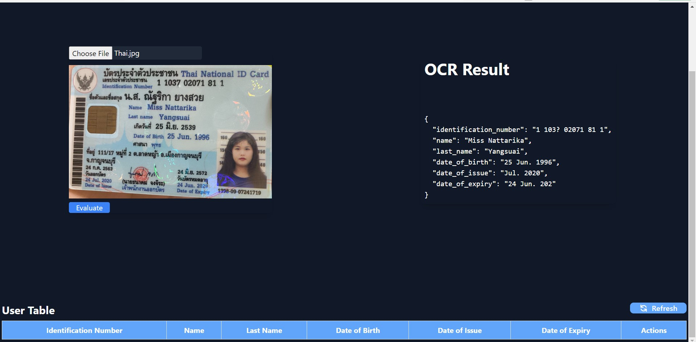
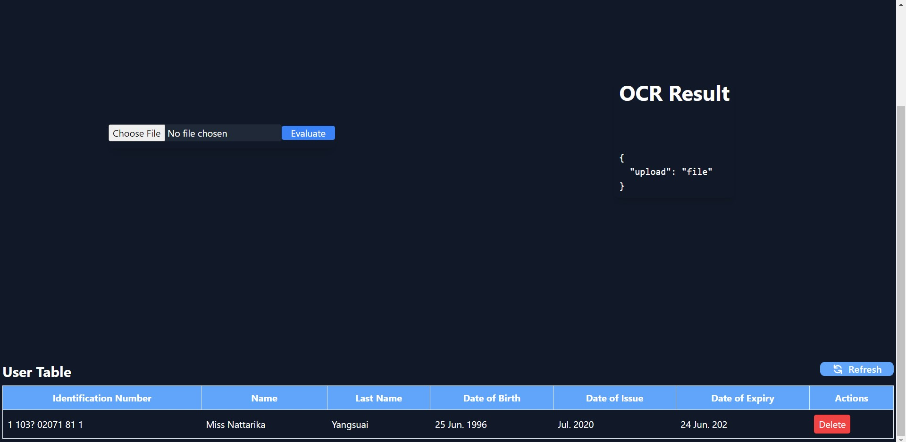

# OCR_Detection
ID card parsing using Online OCR Space API
https://ocr.space/ocrapi  
Free OCR API Endpoint (POST)
https://api.ocr.space/parse/image


# Clone Repository
- git clone https://github.com/saurabhs402/OCR_Detection.git

# Folders
Client-Frontend and Server-Backend using MongoDB  
Open two terminal to run Server and Client separately.

# Run the Server(Running at  http://localhost:${PORT})

 **First Terminal Run Commands**  
 - Change the directory
```bash
    cd server
```  
- Start the server
    
```bash
    nodemon dbConnect.js
```
  
(**Note**: The port number suggested by your nodemon require to update the PORT variable in config.js and you can find config.js inside the OCR_Detection/client
/src/ )

# Render Frontend
 **Second Terminal Run Commands**  
- Change the directory
```bash
cd client
```
- Start the Client
```bash
 npm start
```  

  (Now application starts Running)

# Screenshots
**Evauationg the THAI id card using above mentioned API and showing the result of parsed image**

    
  

  


      
**ID card values stored in Datasbe can perform delete also using delete button**

    



